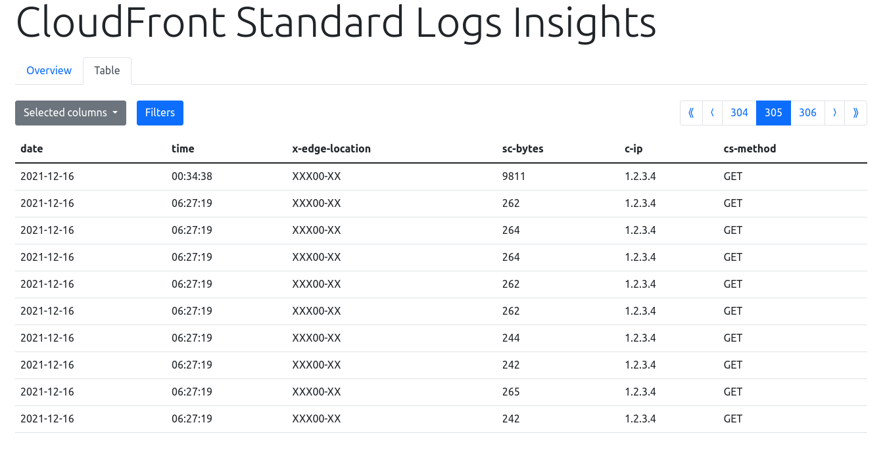
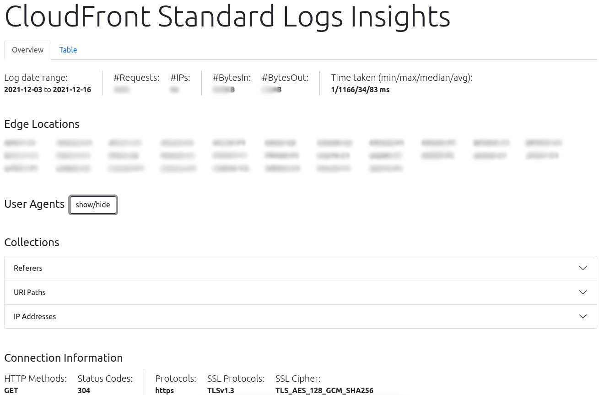

# cloudfront-standard-logs-insights

Web application to get insights to CloudFront standard logs stored in S3

## Features

-   Overview with general statistics
    -   Log date range
    -   Total number of requests
    -   Total number of different IP addresses
    -   Network volume bytes in and out
    -   All edge locations
    -   All User Agents
    -   Collections for referers and URI paths
    -   More connection information (protocols, ciphers and status codes)
-   Table view
    -   Custom column selection for what you are interested in
    -   Filters
    -   Pagination

Empower yourself and get insights from otherwise boring text-based logs.

## Prerequisites

-   NodeJS
-   CloudFront Distribution with Standard Logs stored in S3
-   AWS Account & AWS CLI

## Build

1. Build the ui via
    ```bash
    cd ui
    yarn && yarn build
    ```
2. Build the expressjs server app:
    ```
    cd ..
    yarn
    ```

## Sync the logs from an S3 bucket

Use the `sync.sh logs.example.com` script or the AWS CLI to copy the log files from S3 into a `.logs` folder.

## Development

For better development experience use `yarn dev` to serve the static web app and `npm run build:watch` for the `ui`.

## Screenshots



